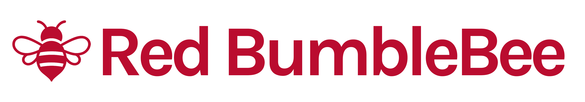

**Modern Student Management for Early Childhood Education Centers**

RedBumbleBee is a secure, multi-tenant SaaS platform designed specifically for early childhood education centers to streamline student enrollment, staff management, and classroom operations.

## 🎯 What We Do

RedBumbleBee eliminates the administrative burden for preschools, daycares, and early learning centers by providing:

- **Centralized Student Management** - Track students from enrollment through their educational journey
- **Family-Centric Organization** - Manage students and guardians together as family units
- **Secure Multi-Tenant Architecture** - Complete data isolation between education centers
- **Role-Based Access Control** - Appropriate access for administrators, staff, and guardians

## 🚀 Key Features

- **Student & Family Management** - Comprehensive enrollment and family data organization
- **Role-Based Access** - Secure permissions for administrators, staff, and guardians
- **Multi-Tenant Architecture** - Purpose-built for education centers of all sizes
- **Modern Web Interface** - Responsive design for desktop and mobile access

## 🏗️ Architecture

RedBumbleBee is built on modern cloud-native principles:

- **Backend**: .NET 9 Web API with vertical slice architecture
- **Frontend**: Blazor WebAssembly for responsive, interactive UI
- **Database**: SQL Server with row-level security for tenant isolation
- **Authorization**: OpenFGA for fine-grained permission management
- **Infrastructure**: Microsoft Azure with Terraform IaC

## 🔒 Security & Compliance

We take data security seriously:

- **Encryption**: Data encrypted at rest and in transit
- **Authentication**: JWT-based secure authentication
- **Authorization**: Fine-grained permissions with OpenFGA
- **Compliance**: Architecture designed with COPPA and FERPA considerations
- **Audit Trails**: Complete logging of data access and modifications

## 🛠️ Technology Stack

- **.NET 9** - Latest framework with C# 13
- **Blazor WebAssembly** - Rich, interactive web UI
- **Entity Framework Core** - Database access layer
- **OpenFGA** - Fine-grained authorization
- **Azure** - Cloud hosting and services
- **Docker** - Local development infrastructure
- **Terraform** - Infrastructure as Code

## 🎨 Design Philosophy

- **User-Centric**: Intuitive interfaces designed for busy education professionals
- **Mobile-First**: Responsive design works on phones, tablets, and desktops
- **Security-First**: Built with privacy and compliance from the ground up
- **API-First**: RESTful API enables future integrations and mobile apps

## 📈 Roadmap

- ✅ Core multi-tenant infrastructure
- ✅ Student and family management
- ✅ Secure user management
- 🚧 Enhanced enrollment workflows
- 📋 Additional features in active development

---

Built with ❤️ for early childhood educators who deserve better tools.
